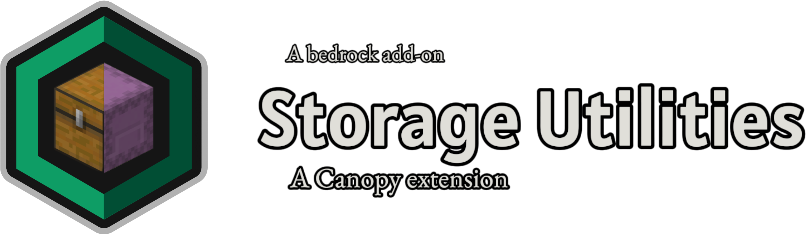

# What is Storage Utilities?
Storage Utilities is an addon aimed to improve the process of making a system related to storage tech. It’s an extension of [Canopy](https://github.com/ForestOfLight/Canopy) developed by ForestOfLight and will require Canopy to function as intended.

## Helpful links
[Canopy Discord server](https://discord.gg/9KGche8fxm)

[Storage Utilities Discord server](https://discord.gg/fA2E4xK28n)
